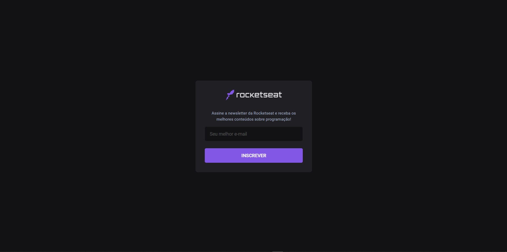

# Next.js Functions

### What is

 - Serverless Functions da Vercel to save user data de um in MongoDB using ReactJS and Next.js.

### Project flow

  

  

Project made following [Rocketseat Code/Drops #54](https://youtu.be/Cz55Jmhfw84) 🚀
